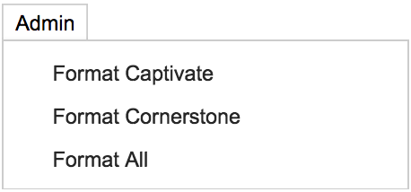
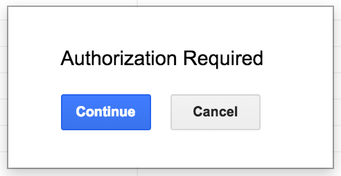
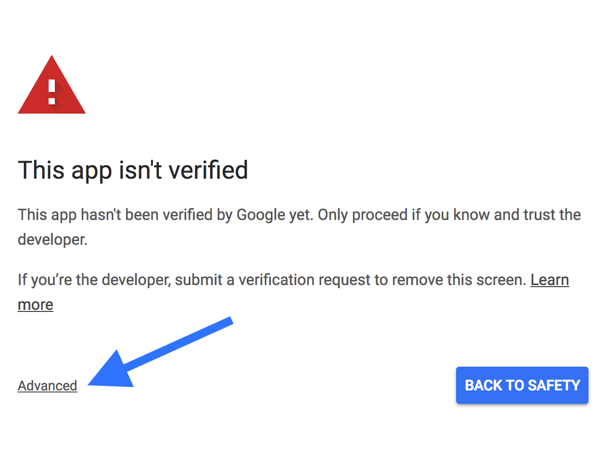
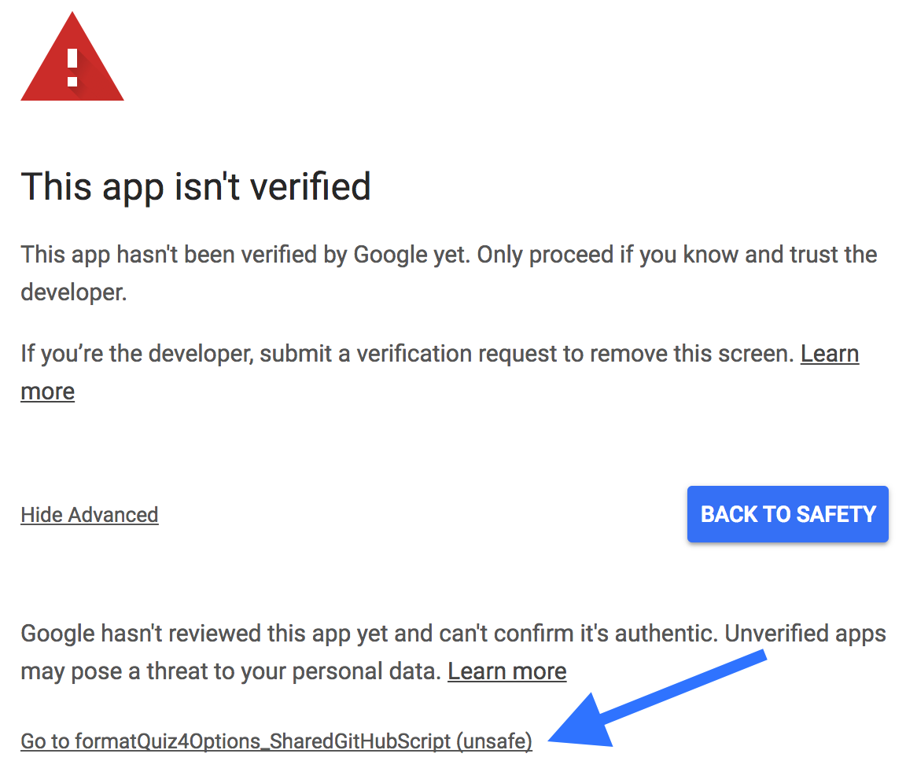
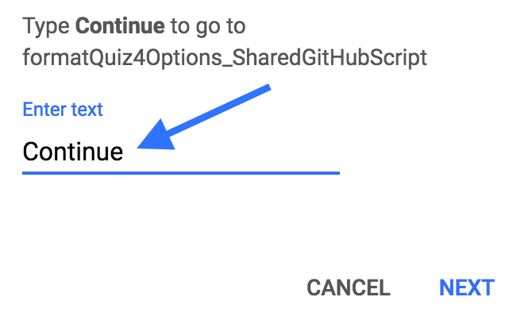

d# Overview
This program automates the process of copying quiz questions from a spreadsheet and pasting them into Adobe Captivate or Cornerstone OnDemand (CSoD). This code has proven successful in decreasing a workload that would take hours to complete down to just a few minutes. There are two versions of this program. One version can be used for quizzes with 4 response options (<i>i.e.</i> A-D), and the other for quizzes with 5 response options (<i>i.e.</i> A-E). You will need a Google account to run this program.

# Initial Setup

### Template Sheet

Navigate to my <a style="color:#0D6EE4" href="https://drive.google.com/open?id=0B5w_Rm6Jrg-PcnBkSDY3aE90cTg">task automation folder</a>.
Choose either the 4 or 5 response option quiz, right click the file, and select <i>Add to My Drive</i>. This will create a copy of the file in your google drive. I recommend setting this initial copy as your quiz template. Duplicate your template whenever you want create a new quiz.

Select the tab labeled <i>dataMappingQuestions</i>, and take a look at the following columns:
* Column B: Cell B4 and beyond serve three purposes.
  1. Categorizes the quiz. Navigate to the tab labeled <i>questions</i> and select a value from the dropdown menu in cell A1.
  2. The value selected in the previous step will also be applied to the name of the file that's created after running the program. Change the provided values to match naming conventions of your files.
  3. For people working with CSoD, columns A-C will need to be modified to match the test  id's, names, and status associated with your CSoD account.
 
 
* Column E: Cell B4 and beyond serve one purpose.
  1. These values help further categorize each question. Change the provided values to match your naming conventions. Navigate to the tab labeled <i>questions</i> and view any cell in the C4:C range to see the values in the dropdown menus.

In most cases, the <i>questions</i> tab will be the only section you'll be working with. So you can hide the remaining tabs if needed.

Navigate to the tab labeled <i>questions</i>. Fill out the spreadsheet with quiz questions and responses. Here are a few things to note:

|A-D|A-E|Notes|
|---|---|----|
|Cell A1|Cell A1|<i>Required</i>: select a value from the drop-down. This value will be used for titles after running the program. As stated previously, these values can be changed by following this path <i>dataMappaingQuestions</i> tab > Column B.|
|Column B|Column B|<i style="color:#d00c51">Required</i>: The question number of each problem.|
|Column C|Column C|<i style="color:#d00c51">Required for CSoD only</i>: This value will be used for to further categorize each question after running the program. As stated previously, these values can be changed by following this path <i>dataMappaingQuestions</i> tab > Column E.|
|Column D|Column D|<i style="color:#449c0d">Optional</i>: The file name of additional resources related to the problem.|
|Column E|Column E|<i style="color:#d00c51">Required</i>: There are three question types that can be selected, <i>True/False</i>, <i>Multiple Choice – Single Answer</i>, and <i>Multiple Choice – Multiple Answer</i>. The selected question type will set the available answer options.|
|Column F|Column F|<i style="color:#d00c51">Required</i>: Question to the problem.|
|Column G-J|Column G-K|<i style="color:#d00c51">Required</i>:  Character limit = 500. The number of response options required depend on the question type selected in Column E. For example if the question type is <i>True/False</i>, the response options in columns G & H are the only values required, and these values will be set by this app.|
|Column K|Column L|<i style="color:#d00c51">Required</i>: As stated previously, the options available for an answer depend on the question type selected in column E.|
|Column L|Column M|<i style="color:#449c0d">Optional used for CSoD only</i>: Character limit = 300. Explanation to an answer if learner responds to problem incorrectly. It can be used to provide additional information or point to a previous section to reinforce learning.|
|Column M|Column N|<i style="color:#449c0d">Optional used for Captivate only</i>: Captivate quizzes can be grouped into question pools. This feature captivate separates questions into separate text files that can be imported into Captivate's different question pools.|

### Script Editor
Open either the 4 or 5 option file from your drive and navigate to the menu bar. Click <i>tools</i> and select <i>Script editor</i>. A new tab should open in the browser titled <i>formatQuiz4Options_SharedGitHubScript</i> or <i>formatQuiz5Options_SharedGitHubScript</i>. Either tab should have following listed files:

1. <i>captivate.gs</i>
2. <i>characterLimits.gs</i>
3. <i>choiceTF.gs</i>
4. <i>cornerstoneAnswers.gs</i>
5. <i>cornerstoneQuestions.gs</i>
6. <i>googleDrive.gs</i>
7. <i>menuBar.gs</i>
8. <i>objectQuestions.gs</i>
9. <i>playground.gs</i>
10. <i>quizCaptivate.gs</i>
11. <i>quizCornerstone.gs</i>
12. <i>quizProtocol.gs</i>
13. <i>reusableFunctions.gs</i>
14. <i>templateKnowledgeCheck.gs</i>
15. <i>validationRules.gs</i>

If you can't locate these files, select <i>File</i> > <i>New</i> > <i>Script File</i> > name the file, then copy/paste the corresponding scripts located in the root folders of this <i>GitHub</i> repository.

### Run the Search
The first time you try to run this app, <i>Google</i> will inform you the app must be approved. Select this <a style="color:#0D6EE4" href="https://support.google.com/cloud/answer/7454865">google clould help link</a> to learn how to verify the app. You can bypass the previous process by following these steps:

1. Navigate to the menu bar, click <i>Admin</i>, and select <i>Format Captivate</i>, <i>Format Cornerstone</i>, or <i>Format All</i>.
 

 

2. A pop-up will appear letting you know authorization is required. Click the button labeled <i>Continue</i>.
 

 

3. Select the <i>Google</i> account you wish to use. Then select the link labeled <i>Advanced</i>.
 

 

4. Click the link at the bottom. It should be labeled with the name of the script being used to run this app. Unless you rename the script it should be labeled as <i>dailyReport_SharedGitHubScript</i>.
 

 

5. Type the word <i>Continue</i> in the text box and click <i>NEXT</i>.
 

 

6. Once verified, the app should run. But, if it doesn't, repeat step 1 and that should do the trick.

7. If this is your first time running the app, wait for the script to finish running, then open your google drive and search within the root directory for a folder titled <i>quizAutomation</i>. The app created this folder. Notice a subfolder has also been created with the same name that you selected in cell A1 of the <i>questions</i> tab. All files will be placed in the subfolder.

8. Treat the <i>quizAutomation</i> folder's name as a unique id, ensure no other folder in your google drive has the same name. You can move this folder to another location in your drive, any time you run the app, the program will fish out its location.

### Saving and Uploading Files
Navigate to the corresponding subfolder and open either the Captivate or Cornerstone files you want to upload.

* Example files are available for you to practice uploading at the following location <i>./assets/images/dataExamples</i>

* Captivate
  * Click <i>File</i> > <i>Download As</i> > <i>Plain Text (.txt)</i>
  * Open an Adobe Captivate project. Select <i>Quiz > Question Pool Manager... > Import GIFT File > select the file > Open</i>

* CSoD
  * You will have to run the following steps for both  <i>Questions</i> and <i>Answers</i> tabs located in the CSoD excel file.
  * Click <i>File</i> > <i>Download As</i> > <i>Comma-separated values (.csv, current sheet)</i>
  * Cornerstone OnDemand has specific for uploading tests questions and answers into their servers. Ensure files match their upload templates before uploading.
### Modify the script
The questions tab has 4 example question that can be used to see how the program operates. This information can be removed altogether. However, any other changes made to either spreadsheet will require thoughtful consideration, because you will most likely have to make supporting changes within the script. Here are a few tips before getting started:

* To rename the spreadsheet tab names:

  * Click the drop-down icon on the tab that will be renamed, then click <i>Rename</i>.

  * Navigate to the menu bar. Click <i>tools</i> and select <i>Script editor</i>. You will have to run across each script to locate the corresponding sheet names, and replace the strings with the names you create. Ideally I would have created an object that houses the sheet names in one location, but didn't consider this when first creating the app. If you consider doing this, the <i>reusable functions.gs</i> file is a good place to store the object.

* Renaming Headers in the spreadsheet:
  * Navigate to the menu bar. Click <i>tools</i> and select <i>Script editor</i> and locate the <i>reusable functions.gs</i> file. Look for the object that houses the headers you replaced, and supply the new names in the respective locations. You might also have to search each script file to ensure all instances of the headers have been replaced.
